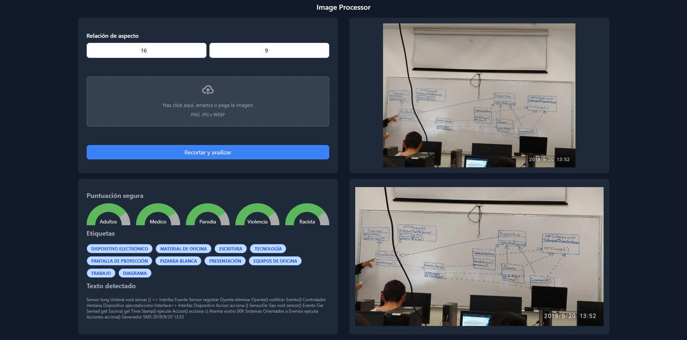

# Image Processor

**Image Processor** es una aplicación web para procesar imágenes. Permite a los usuarios cargar imágenes, recortarlas a una relación de aspecto personalizada, realizar análisis de contenido (incluyendo etiquetas y texto detectado), convertirlas al formato WEBP y subirlas automáticamente a un bucket de Google Cloud Storage.

## Características

- **Carga de imágenes**: Permite cargar imágenes mediante arrastrar y soltar, hacer clic en un área específica o pegar desde el portapapeles.
- **Recorte inteligente**: Usa Google Vision para detectar y ajustar la imagen a la relación de aspecto indicada de manera óptima.
- **Análisis de contenido**: Realiza un análisis de la imagen recortada para obtener etiquetas, texto detectado y detección de contenido explicito.
- **Conversión a WEBP**: Convierte las imágenes a formato WEBP para un mejor rendimiento web.
- **Subida a Google Cloud Storage**: Sube las imágenes procesadas a un bucket de Google Cloud Storage.
- **Formatos soportados**: Acepta imágenes en los formatos PNG, JPG y WEBP.

## Tecnologías Utilizadas

- **Frontend**:
  - HTML5
  - CSS3 (con **Tailwind CSS** para un diseño moderno y responsivo)
  - JavaScript
- **Backend**:
  - PHP
- **Servicios externos**:
  - **Google Vision** (para análisis de contenido y recorte)
  - **TinyPNG** (para compresión y conversión de imágenes)
  - **Google Cloud Storage** (para almacenamiento de imágenes procesadas)

## Instalación

Sigue los pasos a continuación para instalar y ejecutar este proyecto en tu máquina local.

### 1. Clona el repositorio

Primero, clona el repositorio en tu máquina local utilizando Git:

```bash
git clone https://github.com/GerardRamV/img-processor
```

### 2. Navega al directorio del proyecto

Accede a la carpeta del proyecto:

```bash
cd img-processor
```

### 3. Configura un servidor web con soporte PHP

Este proyecto requiere un servidor web con soporte para PHP. Si no tienes uno instalado, puedes usar alguna de las siguientes opciones:

- [XAMPP](https://www.apachefriends.org/index.html)
- [WAMP](http://www.wampserver.com/)

### 4. Crea las carpetas necesarias

Para almacenar las imágenes subidas y procesadas, necesitas crear las siguientes carpetas en el directorio del proyecto:

```bash
mkdir uploads
mkdir processed
```

- **uploads/**: Aquí se almacenarán las imágenes cargadas inicialmente por el usuario.
- **processed/**: Aquí se guardarán las imágenes procesadas antes de ser subidas al bucket de Google Cloud.

Asegúrate de que estas carpetas tengan permisos de escritura para el servidor web.

### 5. Configura las credenciales de Google

Este proyecto utiliza varios servicios de Google, como **Google Vision** y **Google Cloud Storage**. Para que funcione correctamente, debes obtener las credenciales necesarias y configurar el archivo `.env`.

1. **Genera un archivo `.env`** en el directorio raíz del proyecto:

    Crea un archivo llamado `.env` en el directorio raíz de tu proyecto y agrega las siguientes variables de entorno:

    ```env
    GOOGLE_APPLICATION_CREDENTIALS=path/to/credentials.json
    GOOGLE_PROJECT_ID=project-id
    TINIFY_KEY=tinikey
    ```

    - **GOOGLE_CLOUD_PROJECT_ID**: El ID de tu proyecto en Google Cloud.
    - **GOOGLE_CLOUD_KEY_FILE**: La ruta a tu archivo de credenciales JSON generado en Google Cloud.
    - **TINIFY_KEY**: El API KEY obtenido en TinyPNG.

2. **Obtén las credenciales de Google**:
    - Ve a [Google Cloud Console](https://console.cloud.google.com/).
    - Crea un proyecto (si no tienes uno) y habilita **Google Vision API** y **Google Cloud Storage API**.
    - Ve a la sección de **IAM & Admin > Service accounts** y crea una cuenta de servicio con permisos adecuados.
    - Descarga el archivo JSON con las credenciales de la cuenta de servicio y colócalo en una carpeta segura en tu proyecto (por ejemplo, `config/`).

### 6. Coloca los archivos en el directorio adecuado

Coloca los archivos del proyecto en el directorio raíz de tu servidor web (por ejemplo, `htdocs` para XAMPP).

### 7. Accede a la aplicación en tu navegador

Abre tu navegador y navega a `http://localhost/img-processor` para ver la aplicación en funcionamiento.

## Uso

1. **Abre la aplicación**: Una vez que el servidor esté corriendo, abre la aplicación en tu navegador.
2. **Ajusta la relación de aspecto**: Ingresa los valores de ancho y alto deseados para el recorte.
3. **Cargar la imagen**: Haz clic en el área de carga, arrastra y suelta la imagen, o pégala directamente desde el portapapeles.
4. **Recortar y analizar**: Haz clic en el botón "Recortar y analizar" para procesar la imagen. La imagen se recortará, se realizará el análisis y la conversión, y se subirá al bucket de Google Cloud.

## Estructura del Proyecto

El proyecto está organizado de la siguiente manera:

```
/img-processor
├── .env                     # Archivo de configuración con las credenciales de Google y otras variables de entorno.
├── index.php                # Página principal de la aplicación.
├── css/
│   └── styles.css           # Estilos personalizados para la interfaz.
├── js/
│   └── script.js            # Scripts para la funcionalidad del frontend.
├── php/                     # Backend que maneja la carga y procesamiento de imágenes.
│   └── upload.php
│   └── process.php
│   └── helpers.php
├── uploads/                 # Carpeta donde se almacenan las imágenes cargadas por el usuario.
├── processed/               # Carpeta donde se guardan las imágenes procesadas antes de ser subidas al bucket.
└── config/                  # Carpeta para almacenar archivos de configuración como el archivo de claves JSON de Google.
```

## Contribuciones

Las contribuciones son bienvenidas

## Licencia

Este proyecto está bajo la licencia **MIT**.

